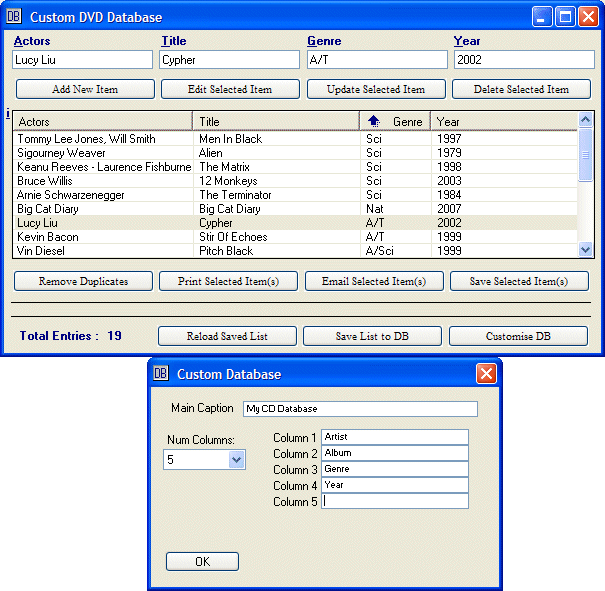



## A Customizable CD/DVD/Etc Collection Database Program v1\.5

### Description

This is a customizable CD/DVD/etc collection database program. Use it to document your collection of CD'd, DVD's, or other collection you might have. Uses a simple flat file to store the data. Included is an Excel spreadsheet that can open the flat file db. Update 1.5 no longer requires the default database and allows easier creation of new db's. Update 3rd June - Fixed spreadsheet.
 
### More Info
 

             |
---                |---
**Submitted On**   |2011-05-29 12:17:48
**By**             |[Rde](https://github.com/Planet-Source-Code/PSCIndex/blob/master/ByAuthor/rde.md)
**Level**          |Intermediate
**User Rating**    |5.0 (20 globes from 4 users)
**Compatibility**  |VB 5\.0, VB 6\.0
**Category**       |[Complete Applications](https://github.com/Planet-Source-Code/PSCIndex/blob/master/ByCategory/complete-applications__1-27.md)
**World**          |[Visual Basic](https://github.com/Planet-Source-Code/PSCIndex/blob/master/ByWorld/visual-basic.md)
**Archive File**   |[A\_Customiz220561632011\.zip](https://github.com/Planet-Source-Code/rde-a-customizable-cd-dvd-etc-collection-database-program-v1-5__1-73318/archive/master.zip)

